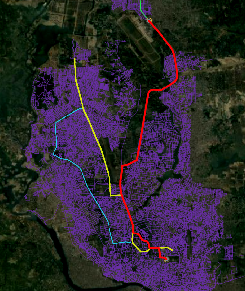
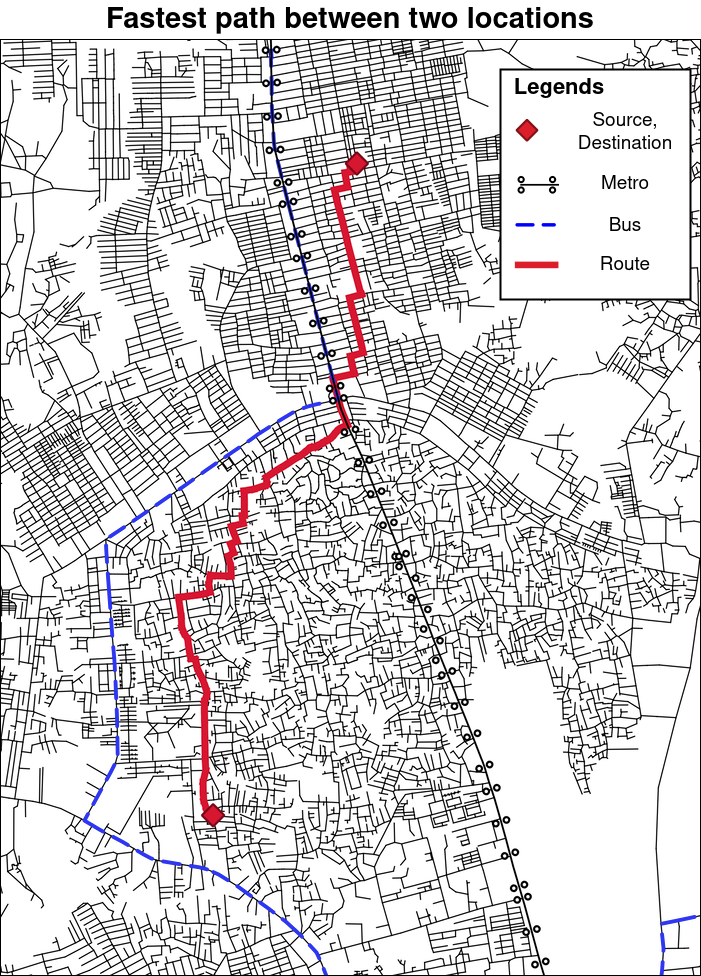
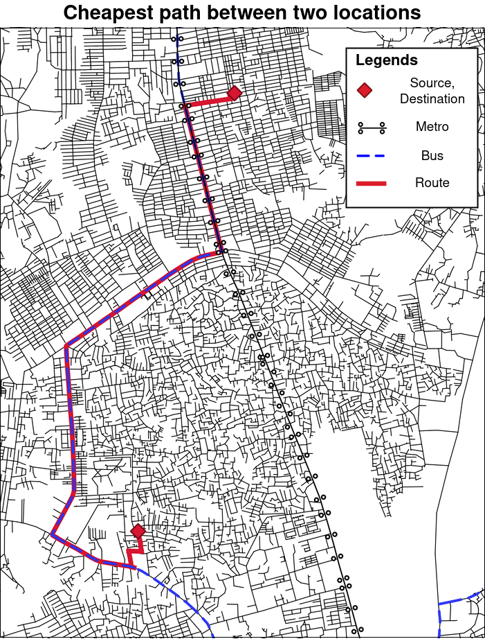

# Shortest Route Analysis of Dhaka City Roads Using Various GIS Techniques

This repository is the code base of a [hackathon competition](http://codesamuraibd.net/), as well as a research article submitted to [Computers & Geosciences](https://www.journals.elsevier.com/computers-and-geosciences/). 

In this repository, cost estimation, street density and shortest path analysis is done with the help of [qgis](www.qgis.org) and [python](www.python.org) programming language and its open-source packages.

### Requirements

##### Python packages

- pandas: To read csv files

- geopandas: To read shapefiles and geo csv files

- descartes: I don't know why it does not automatically get installed with geopandas, but you need it or geopandas will not work

- networkx: This is the main module by which, the algorithm is implemented

- fiona: To help geopandas also read and write kml files

- shapely: To plot basic shapes/lines/points on notebooks

- tqdm: To show loading progress bar

**For better visualization and street density analysis, vanilla qgis software is used.**

Please refer to the jupyter notebook [main.ipynb](main.ipynb) for the main code. It is commented and self explanatory (if you are familiar on how to use those python packages).

*Have a peak in a small part of the code [here](https://htmlpreview.github.io/?https://github.com/rahatzamancse/gis-analysis-of-dhaka-city-roads/blob/master/main.html).*

## What this code does?

Suppose we have a map and some rickshaw puller fare for some places in Dhaka city. We also have the list of costs to move around with the help of bus and metro in Dhaka city.

Now if you run the code from a specific place, and ask to go to a place **as fast as possible**, then the output will be like this.

Again if you want to go to a place at as low cost as possible, then the output will be like this (Of course, the algorithm is designed so that it will not tell you to walk the whole way).

To understand about the algorithm, please refer to the related paper. ([will be updated]()) as soon as the paper gets published.

**N.B.** For road density analysis and cost estimation, please refer to [Data](Data/README.md) folder.

This repository is under [GNU GPL3](https://www.gnu.org/licenses/gpl-3.0.en.html) license.
